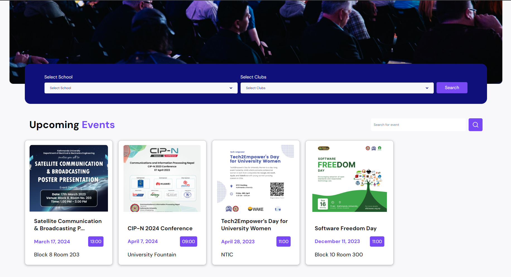

# KUvents

KUvents is a dynamic web application tailored to revolutionize event management at Kathmandu University. Leveraging NodeJS and React, along with SCSS and JavaScript, KUvents aims to streamline event coordination and engagement.

## Purpose
The project's purpose is to provide club administrators with an efficient platform for event creation, promotion, and seamless user interaction. By integrating dedicated administrators and super administrators, the platform ensures event integrity and managerial oversight. The expected outcome is a user-centric event management system that enhances event coordination, fosters participation, and enriches the overall campus experience.

## Objectives
- **Centralized Platform**: To create a centralized platform to showcase and promote events from all university departments and clubs, facilitating smooth information sharing and ensuring that a wider audience becomes aware of these activities.
- **Robust Verification Process**: To implement a robust verification process to list events, including enabling users to filter and sort events by categories, date, time, and organizer.
- **Real-Time Notifications**: To facilitate real-time notifications for users interested in specific event categories, minimizing the likelihood of missing out on events by providing timely updates.

## System Requirements
### Software Specifications
The software specification is different for clients and administrators (developers).

**Front End Tools**:
- React
- JavaScript
- SCSS

**Back End Tools**:
- NodeJS
- MongoDB (Mongoose)

### Hardware Specifications
The only hardware required to run this application is a well-functioning computer, though the quality of use may depend upon the condition of the PC.

## Features
The features of KUvents are discussed below:
- **View Events**: Users will be able to view the upcoming events.
- **Sort Events**: Users can sort events by school and clubs.
- **Event Details**: Users can view detailed information about the event, including date, time, location, school, club, and banners.
- **Event Booking**: Users can book the events according to their interest.
- **Event Logs**: Admins can view logs about the events that were organized, including who organized them.
- **Event Management**: Authorized users from respective clubs will have the ability to create, modify, and delete events, providing all the necessary information.
- **Verification Process**: Verification emails will be sent to the respective club’s HOD, and events will be posted upon their approval.
- **To-Do List**: Admins can create a to-do list for the smooth creation of events, which is shared among the associated members of the club.
- **SuperAdmin Control**: SuperAdmin can create, update, or delete any user event or clubs upon request or as needed from SuperAdmin tools.
- **Event Approval**: SuperAdmin has the ultimate say on event approval.
- **User Creation**: SuperAdmin has the responsibility of creating associated users of a club.

## Conclusion
KUvents aspires to redefine event management and participation at Kathmandu University, aligning seamlessly with university needs and fostering a culture of collaboration. It is recommended that this platform becomes an integral part of the university's event coordination endeavors.

